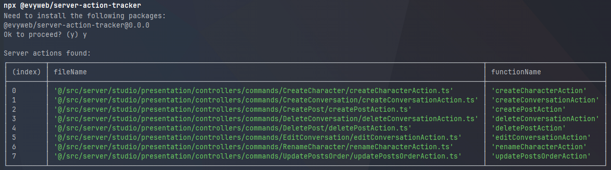

#  Server Action Tracker
This is a simple server action tracker that logs all the potential server actions available in your application.



## Usage

By default, it will search for server actions in these directories:
```json
[
  "app/**/*.ts",
  "src/**/*.ts",
  "packages/**/*.ts"
]
```

It will also ignore the following files:
```json
[
  "!**/*.spec.ts",
  "!**/specs/**/*.ts"
]
```

If the basic configuration is not enough for you, you can directly use the package without installing it.

At the root of your project, run the following command:

```bash
npx @evyweb/server-action-tracker
```

## Configuration

You can also configure the server action tracker by adding a serverActionTracker property in your package.json file.

Here is an example of a configuration:

```json
{
  "serverActionTracker": {
    "files": [
      "src/**/*.ts",
      "packages/**/*.ts"
    ]
  }
}
```

The configuration is optional, and the default configuration will be used if no configuration is provided.